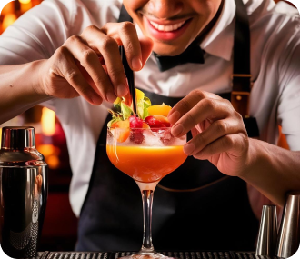
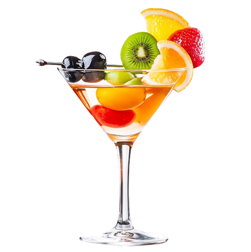

# 🍹 Cocktail App

A modern, visually appealing cocktail-themed web application built with **React** and **Vite**. Explore delicious drinks, beautiful UI, and smooth user experience.

.png.jpg)

---

## 🚀 Features

- Fast and modern React + Vite setup
- Beautiful, responsive design
- Cocktail menu and drink details
- About, Art, and Contact sections
- Custom fonts and stylish images
- Easy navigation with a clean Navbar
- Optimized assets and performance

---

## 📦 Getting Started

1. **Clone the repository:**
   ```sh
   git clone <your-repo-url>
   cd cocktail
   ```
2. **Install dependencies:**
   ```sh
   npm install
   ```
3. **Start the development server:**
   ```sh
   npm run dev
   ```
4. **Open in your browser:**
   Visit [http://localhost:5173](http://localhost:5173)

---

## 🗂️ Project Structure

- `src/` — Main source code (components, styles, entry points)
- `public/` — Static assets (images, fonts, videos)
- `constants/` — App constants
- `index.html` — Main HTML file
- `vite.config.js` — Vite configuration

---

## ✨ Screenshots

| Home                            | Menu                              | About                                | Contact                          |
| ------------------------------- | --------------------------------- | ------------------------------------ | -------------------------------- |
|  |  |  |  |

---

## 🙏 Credits

- UI/UX: [Your Name or Team]
- Images & Assets: [List sources or "All assets are original"]
- Built with [React](https://react.dev/) and [Vite](https://vitejs.dev/)

---

## 📄 License

This project is open source and available under the [MIT License](LICENSE).

---

Enjoy mixing and exploring cocktails! 🍸
